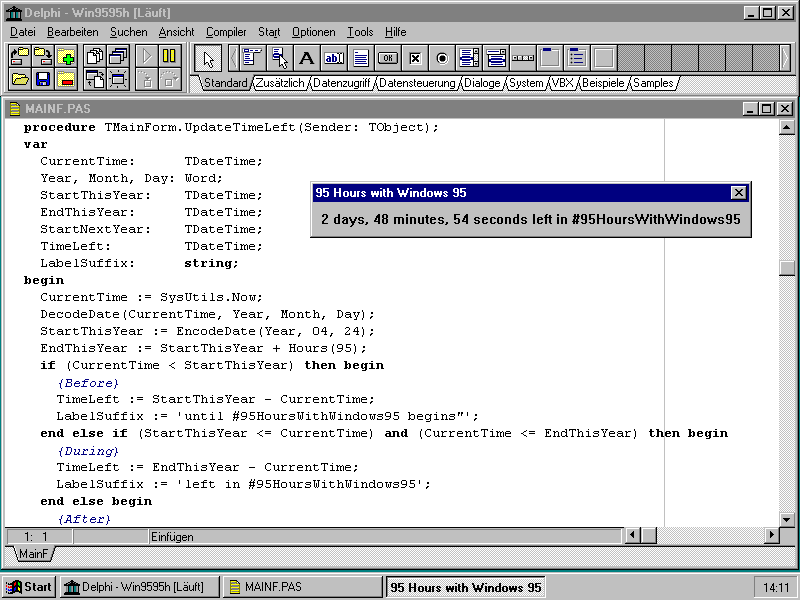

# 95 Hours with Windows 95

In late April of 1996, my family got its first PC. At the time this was a pretty powerful machine with a Pentium 120MHz processor, 8MB RAM, 1.2GB HDD as well as sound and graphics card (2MB of video).

Every year, to mark the occasion, I retrieve this machine from storage and set it up for a few days to play some of the old games ([in 2020 it was *Die Fugger II*](https://personalnexus.wordpress.com/2020/05/03/playing-die-fugger-ii-in-2020/), this year it is *Die Siedler II*), open an Excel spreadsheet from floppy disk and generally enjoy the auditory experience created by all the different sounds computer users today have to do without: floppy drive, monitor switching resolutions, CPU fan and the hard-drive spinning up and seeking.

I have set aside approximately four days for this and have hence created this handy timer to remind me when my [#95HoursWithWindows95](https://twitter.com/hashtag/95HoursWithWindows95) are up. It was written in Delphi 1 on the machine in question.

